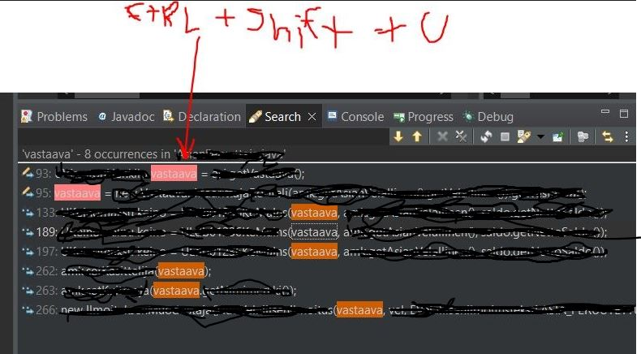

  

   

All course material from **Eclipse Debugging Techniques And Tricks by Learning** by from Experience/Swapan Kumar Dutta 

If the content sparked :fire: your interest, please consider buying the course and start learning :book:

[The Course at Udemy](https://www.udemy.com/course/eclipse-debugging-techniques-and-tricks/)   

[GitHub Course Project Link](https://github.com/j2eeexpert2015/DebuggingTutorial)

[GitHub of Maker](https://github.com/j2eeexpert2015)

Insert certificate here when completed

**Note: The material provided in this repository is only for helping those who may get stuck at any point of time in the course. It is very advised that no one should just copy the solutions(violation of Honor Code) presented here.**

## Eclipse Debugging Techniques And Tricks progress

- [x] [Section 01](https://github.com/developersCradle/eclipse-tool-class/tree/main/Section%201%20eclipse%20debugging) - Introduction to Java Debugging Using Eclipse
- [x] [Section 02](https://github.com/developersCradle/eclipse-tool-class/tree/main/Section%202%20eclipse%20debugging) - Basic Debugging Features
- [ ] [Section 03](https://github.com/developersCradle/eclipse-tool-class/tree/main/Section%203%20eclipse%20debugging) - Advanced Debugging Features
- [ ] [Section 04](https://github.com/developersCradle/eclipse-tool-class/tree/main/Section%204%20eclipse%20debugging) - Sample Debugging Problems And Their Solution
- [x] [Section 05](#) - Thank You!
- [x] [Section 06](#) - Bonus Section

All course material from **Eclipse IDE for Beginners: Increase Your Java Productivity** by Chad Darby 

If the content sparked :fire: your interest, please consider buying the course and start learning :book:

[The Course at Udemy](https://www.udemy.com/course/luv2code-eclipse-ide-for-beginners/)   

[Maker Home Page](https://luv2code.com/)   

**Note: The material provided in this repository is only for helping those who may get stuck at any point of time in the course. It is very advised that no one should just copy the solutions(violation of Honor Code) presented here.**

## Eclipse IDE for Beginners: Increase Your Java Productivity

- [x] [Section 1](#) - Course Introduction and Special Discount Offer
- [x] [Section 2](https://github.com/developersCradle/eclipse-tool-class/tree/main/Section%202%20eclipse%20productivity) - Getting Started with Eclipse 
- [x] [Section 3](https://github.com/developersCradle/eclipse-tool-class/tree/main/Section%203%20eclipse%20productivity) - Managing Source Code
- [x] [Section 4](https://github.com/developersCradle/eclipse-tool-class/tree/main/Section%204%20eclipse%20productivity) - Advanced Features 
- [x] [Section 5](#) - Summary

All course material from **Devtools Pro: The Basics of Chrome Developer Tools** by Rocco Balsamo and if you want to keep going even further, he has also paid course for even better/deeper knowledge.

If the content sparked :fire: your interest, please consider buying the course and start learning :book:

[The Course at Udemy](https://www.udemy.com/course/devtools-2017-the-basics-of-chrome-developer-tools/)   

[Maker Home Page](https://simmer.io/)   

<!--  -->

Insert certificate here when completed

**Note: The material provided in this repository is only for helping those who may get stuck at any point of time in the course. It is very advised that no one should just copy the solutions(violation of Honor Code) presented here.**

## Devtools Pro: The Basics of Chrome Developer Tools

- [ ] Section 1 - The Basics
- [ ] Section 2 - Digging Deeper
- [ ] Section 3 - Bonus

some other todo:
- todo make shortcut pdf and .md
- todo https://www.udemy.com/course/devtools-2017-the-basics-of-chrome-developer-tools/
- todo https://www.udemy.com/course/eclipse-java-tutorial-for-beginners/
- todo https://www.udemy.com/course/eclipse-tips-and-tricks/

# Eclipse hotkeys

> Open implementation - **F3**

- Opens where `Spesification` is **implemented**

> Show all usages of a variable - **Ctrl + Shift + U**

### Debugging hotkeys

> Step Over - **F6**

- Line get executed and control is given in next line 
