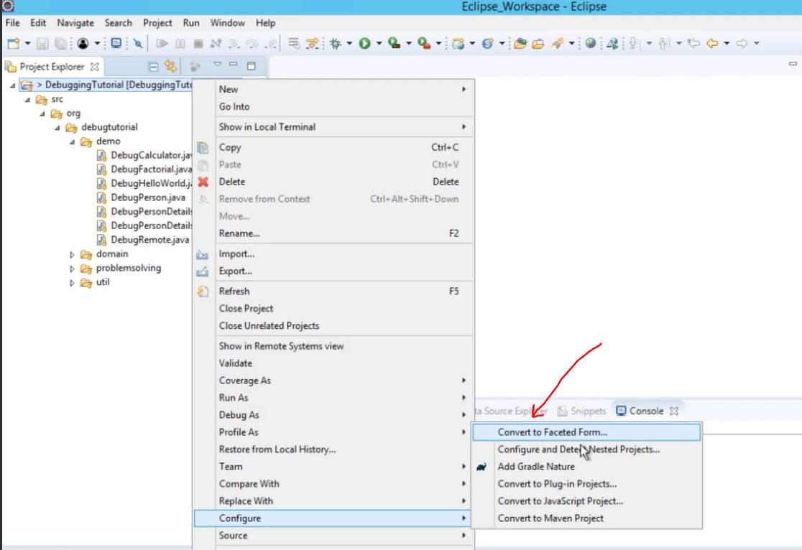
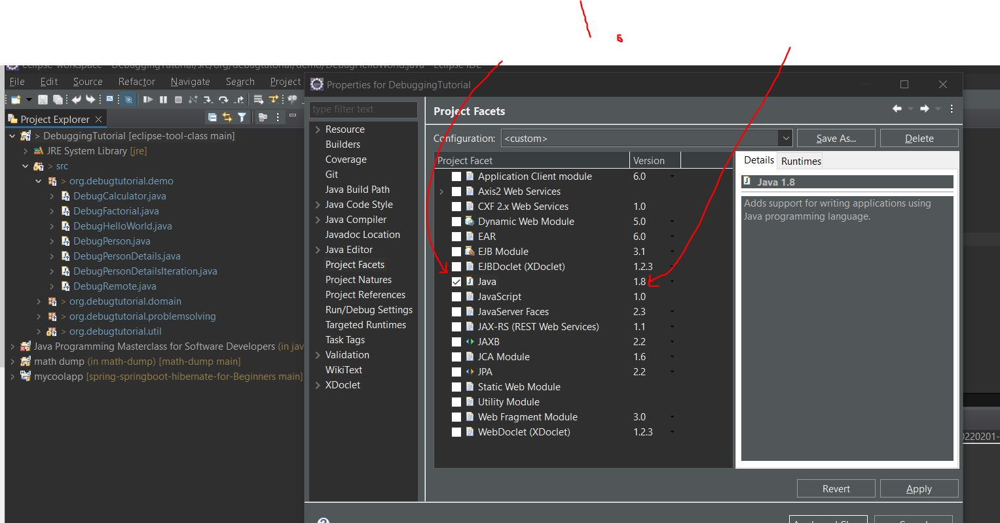

## Section 1: Introduction to Java Debugging Using Eclipse

 Introduction to Java Debugging Using Eclipse

# What I Learned

- Repository [GitHub link](https://github.com/j2eeexpert2015/DebuggingTutorial)

- If you cannot run `.java` files
    - Try to Convert to Faceted Form

 

1. Check Java options, we recommended 1.8