## Section 2: Basic Debugging Features

 Introduction to Java Debugging Using Eclipse

# What I Learned

- Debugging is a methodical process of finding and fixing the bugs in software.

 

- Breakpoint is pause in code.

 

- **Step Over (F6)**, Line get executed and control is given in next line

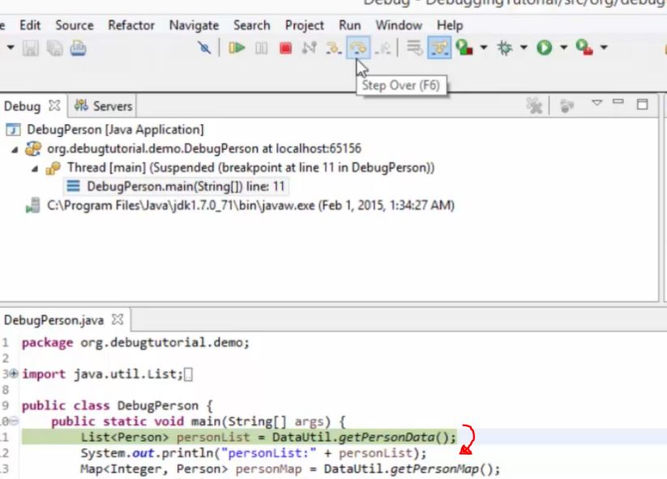

- **Step Into (F5)**
    - Steps into function/method
- **Step Return (F7)**
    - Function/method will be executed and control is returned to caller

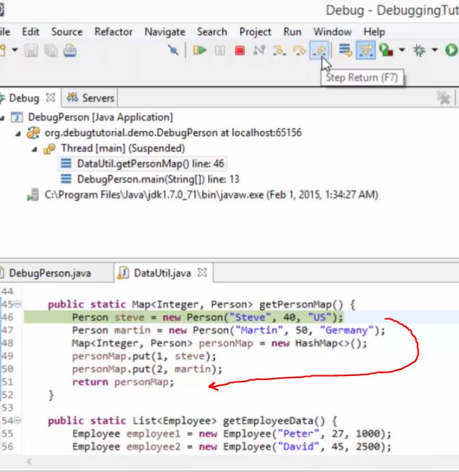

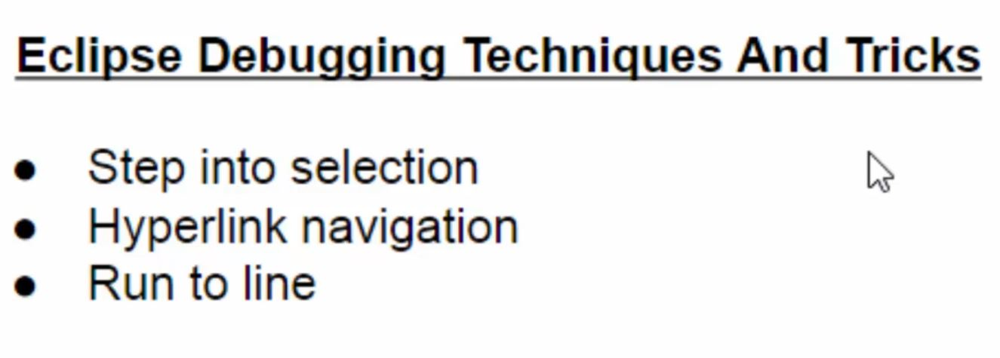

### **Step into selection**

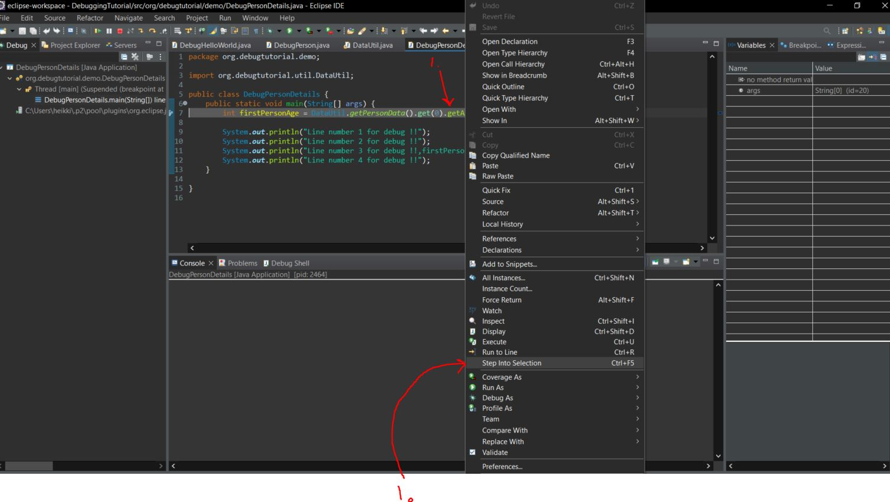

- If you want to go into code inside some chained methods
    - Example `int firstPersonAge = DataUtil.getPersonData().get(0).getAge();`. We would want to go inside `getAge()` whiteout putting breakpoint manually

1. We first focus on method where want to go → Right click and select **Step Into Selection(CTRL+F5)**

- We will find end in `getAge()`

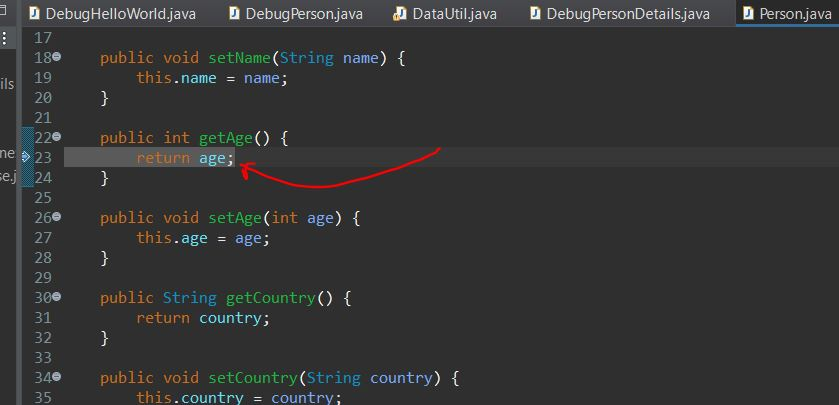

- We can ignore other breakpoints and run into specific line using

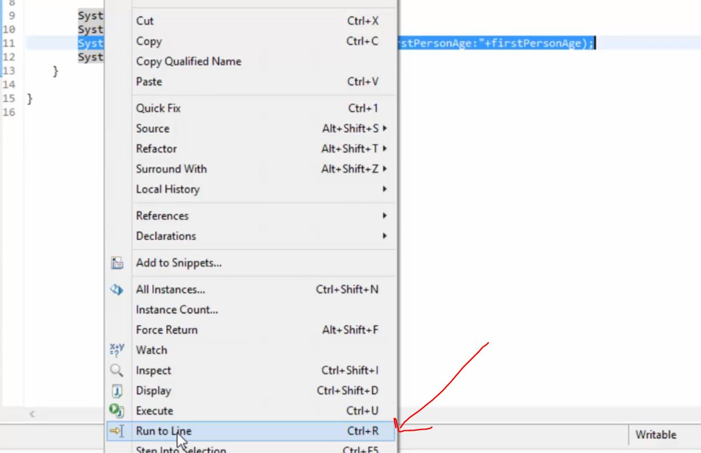

- Skip all breakpoints. **Easy to leave on!**

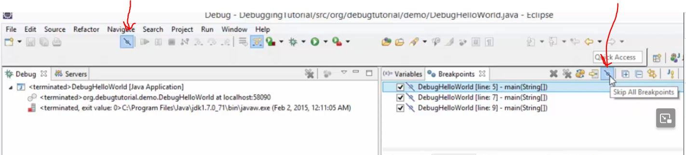

- We can evaluate expressions from `Highlight Expression` then click `Inspect`

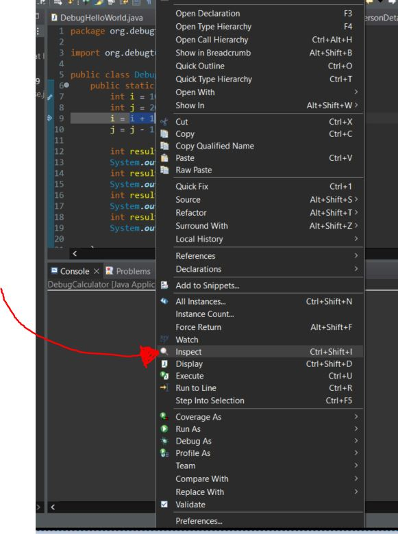

- We can watch expression getting folded out
    - This can be also done in ahead in executed time

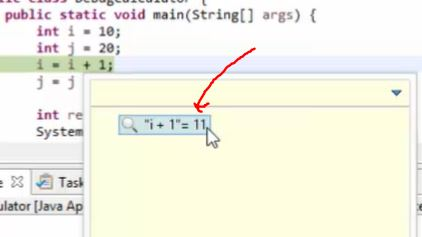

 

- Execute can evaluate input ahead of time, just like inspect expression

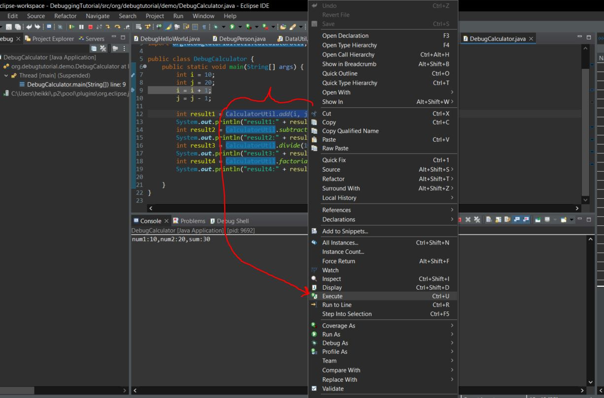

 

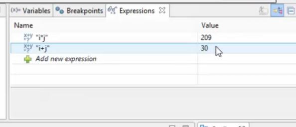

- Expressions are also good way to evaluate values at execution time.
