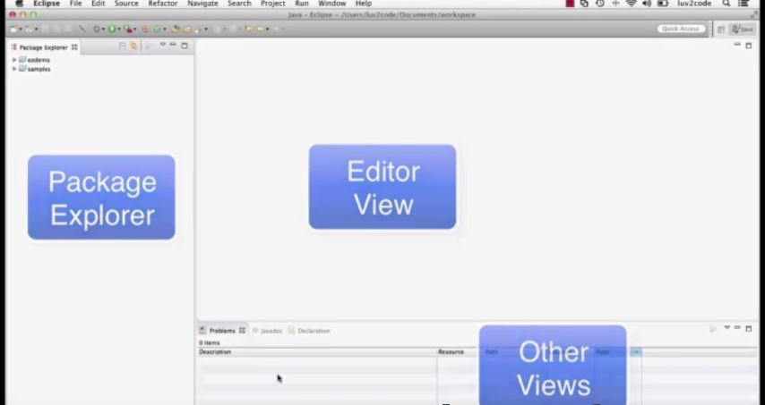
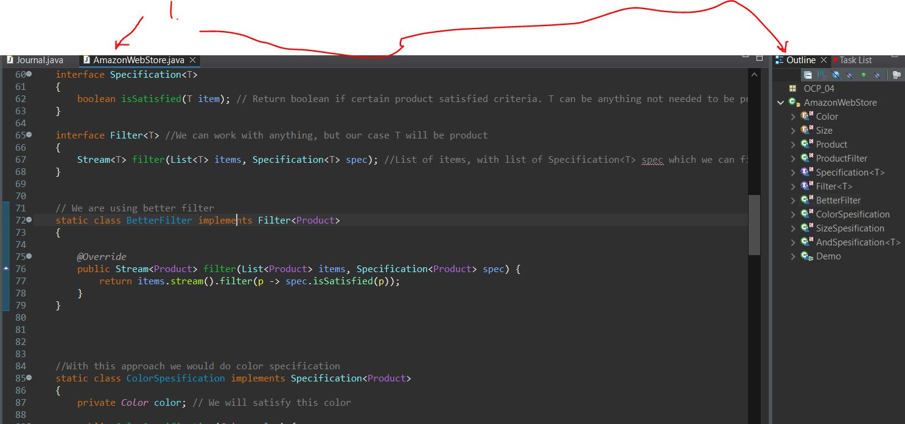
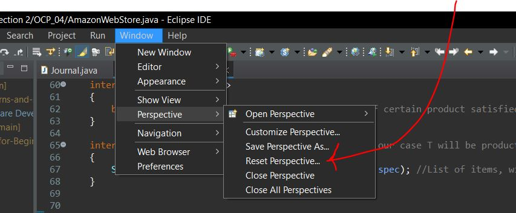

## Section 2: Getting Started with Eclipse

Getting Started with Eclipse

# What I Learned

- Different sections in eclipse IDE

- If lose some window tab, these can be opened form here. Here example Console tab

### Outline View 

> **Window** > **Show View** > **Outline**

- **Outline View** is showing different way to show class

1. Here you can see Outline

- Eclipse can be easily modified window positions

- Eclipse is following concept **Perspective**
    - **Perspective** is how layout is formed in Eclipse IDE

- You can always reset perspective if mess things up

