## Section 3: Managing Source Code

 Managing Source Code

# What I Learned

### Open Type

- Open class by name

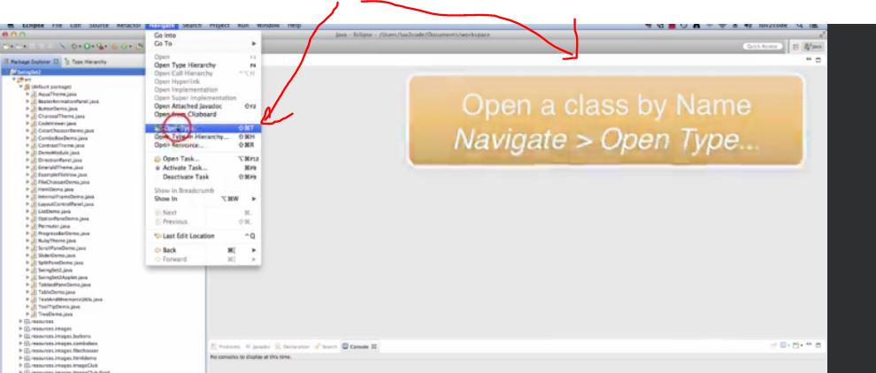

- We can open type by name from here

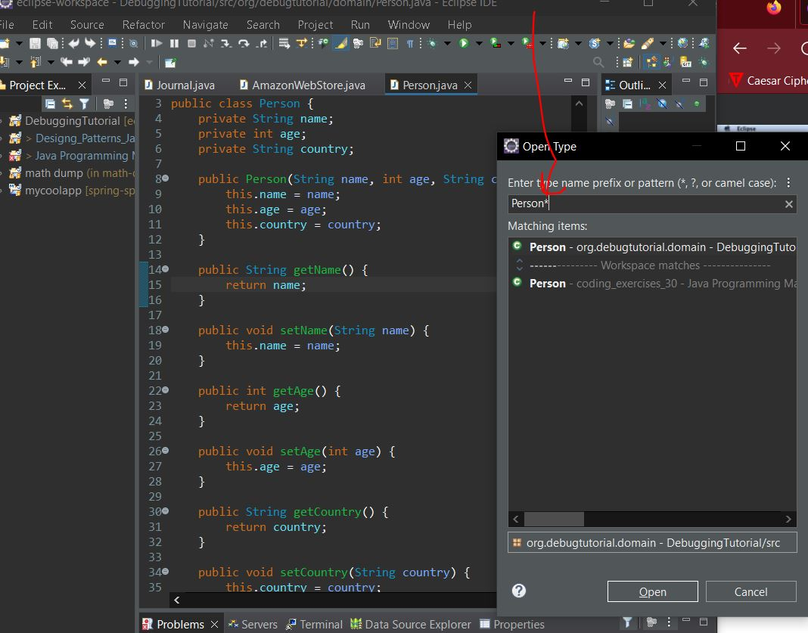

- You can use **wildcards** in Eclipse. Here is usage when opening type

### Quick Outline

- You can open outline view

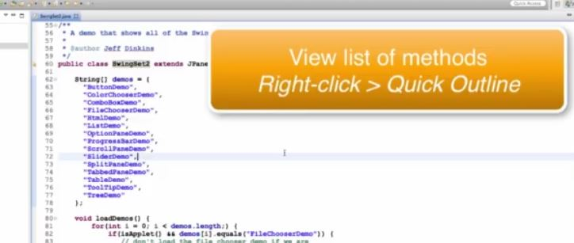

- And it will look like such

- You can also filter in this menu

### Display inheritance tree

> **Navigate** > **Open Type Hierarchy** 

- This will help you to look inheritance tree for class

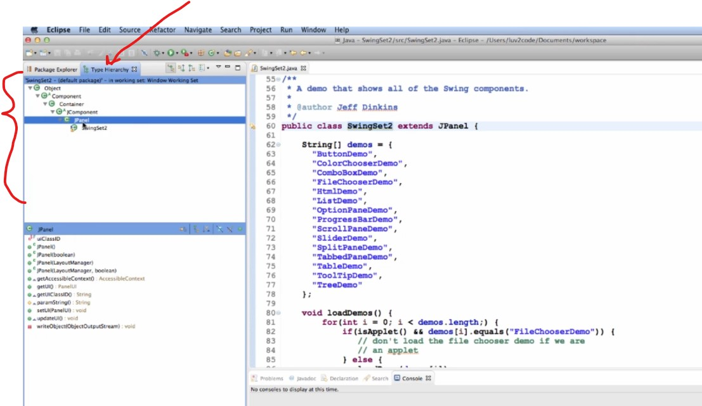

### Display Quick Inheritance Tree

> Right-click > Quick Type Hierarchy

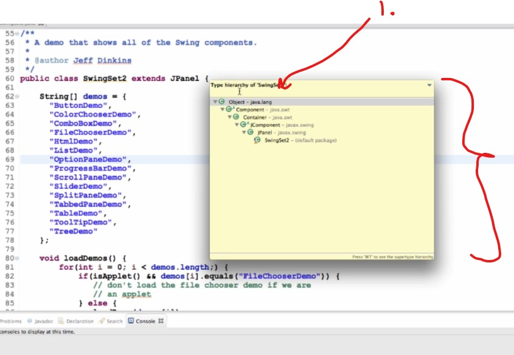

- Quick Type Hierarchy

1. You can type to filter 

### Search For Text

> CTRL + F

- Search for text, with different tools

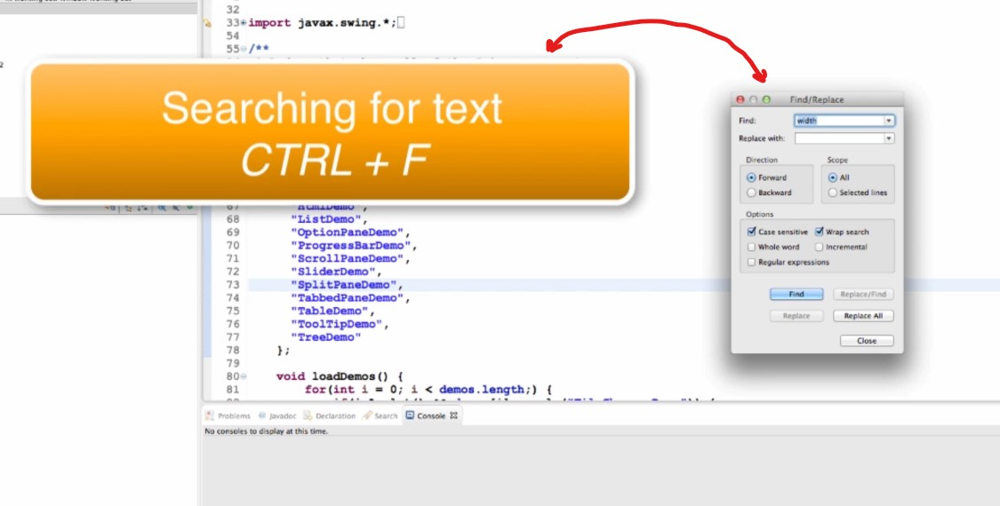

- If you have multiple files

### Search For Multiple Files

> Search > Search 

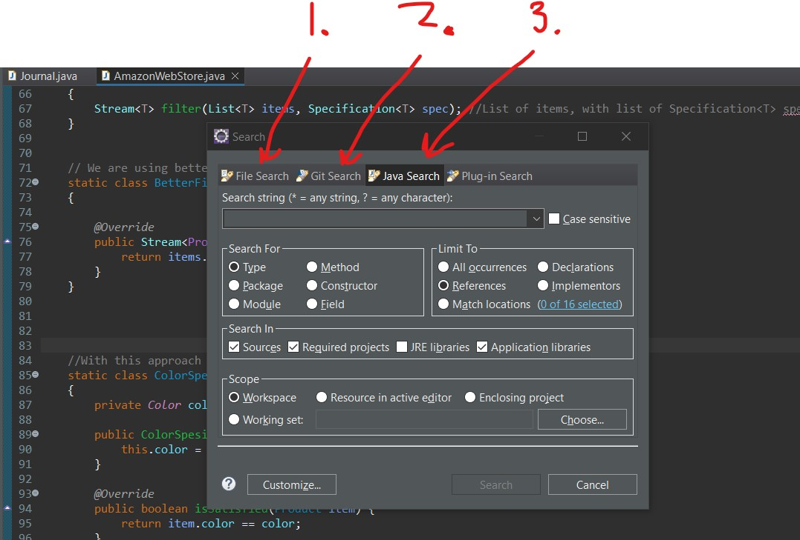

1. **File Search**, can search plain text from multiple files
2. **Git Search**, you can search against Git repository
3. **Java Search**, search against Java constructs

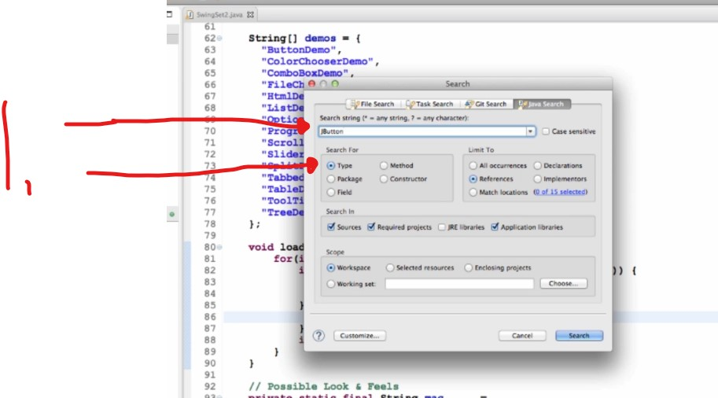

1. We are searching for where `JButton` is used in this project

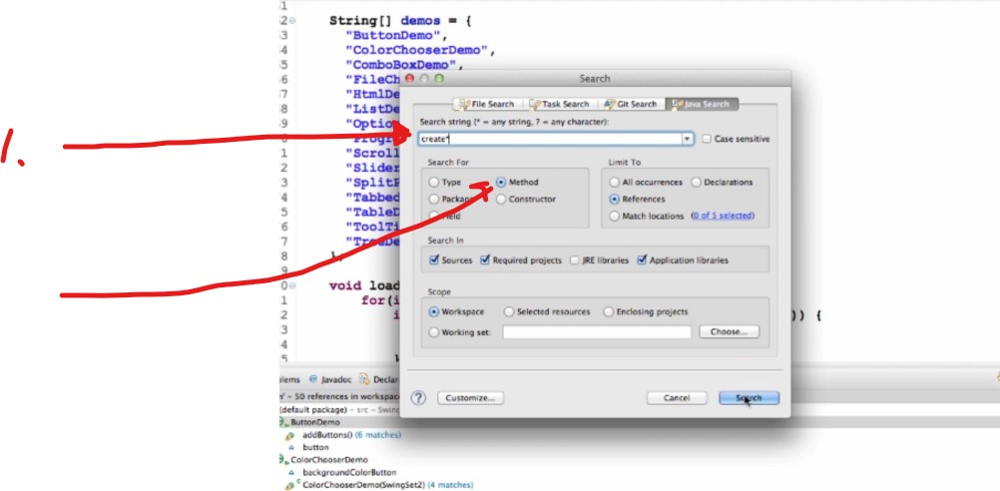

1. We are using `*` wild card with method name `create*`. Searching **method** name start with `create`

### View Method Detail

> Right-click > Open Declaration (**F3**)

- Opens declaration of method when opened 

### Finding Reference For Method

> Right-click > References > Workspace

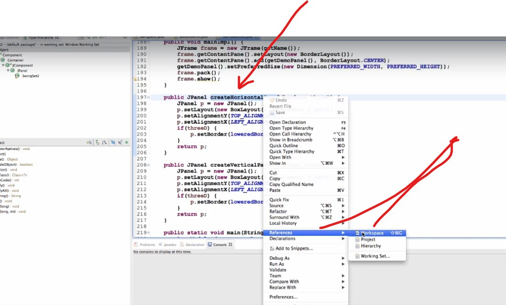

- We can look where this method is being called

### Call Hierarchy: Sequence of methods calls

> Right-click > Open Call Hierarchy

- Given sequence of methods calls

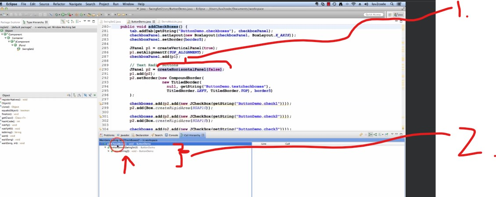

1. We are calling `Call Hierachy` here
2. We are reading this from **top** to **bottom**. **Main method** is calling our **constructor** which in sense is calling **our method** `create*` 

### Generating Getters and Setters

> Right-click > Source > Generating Getters and Setters

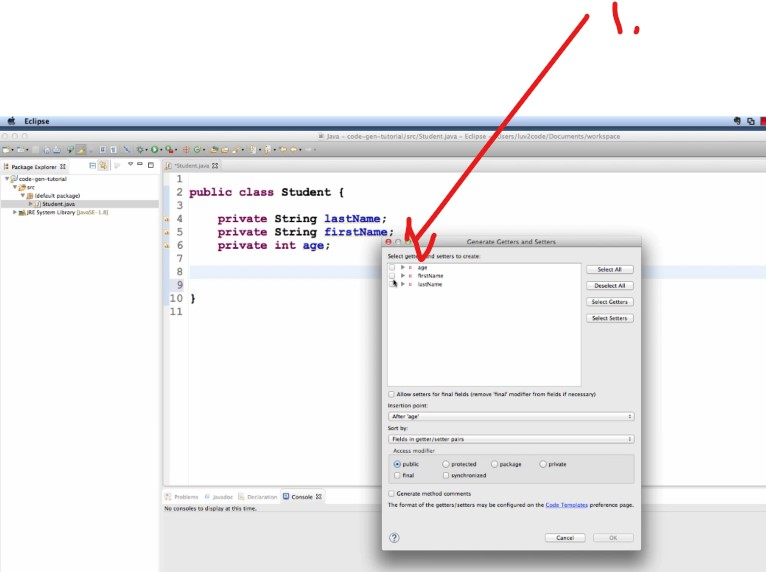

1. We can generate fetters and setters from class fields

### Generating Constructor using fields

> Right-click > Source > Generating Constructors using fields

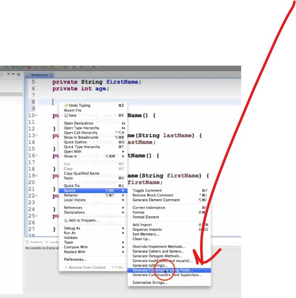

### Override / Implement Methods

> Right-click > Source > Override / Implement Methods

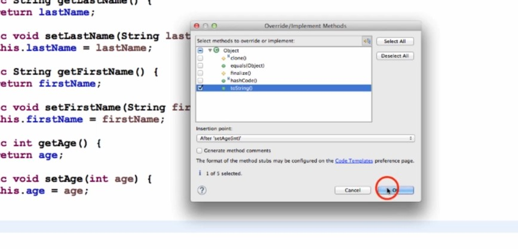

- Usually we be overriding `toString()` method

### Template shortcuts

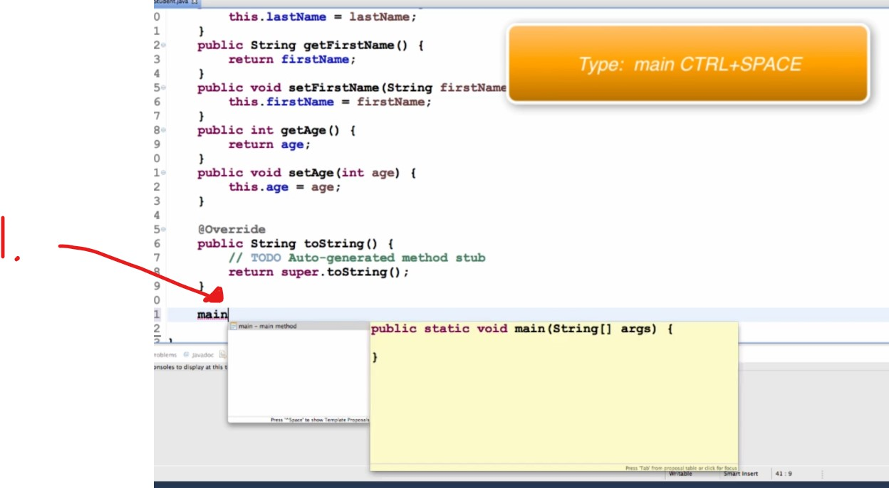

1. `Ctrl+Space` will auto complete code from template 
    - These can be found in Eclipse 
> Java > Editor > Templates > Main

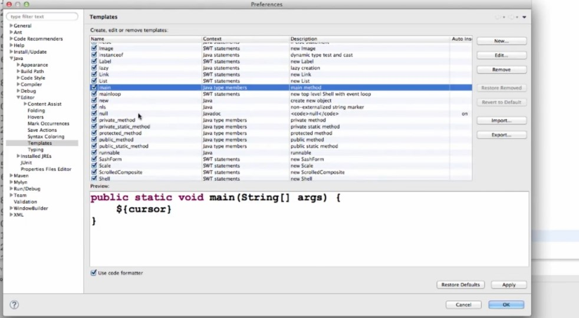

### Format

> Right-click > Source > Format

### Refactoring

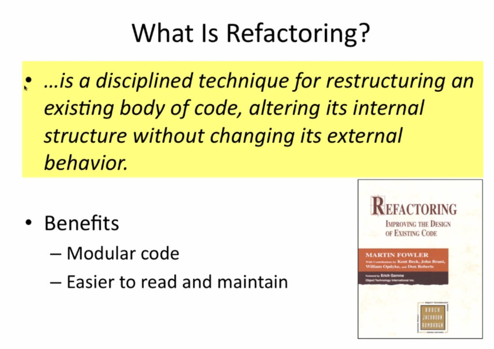

### Extract Constant

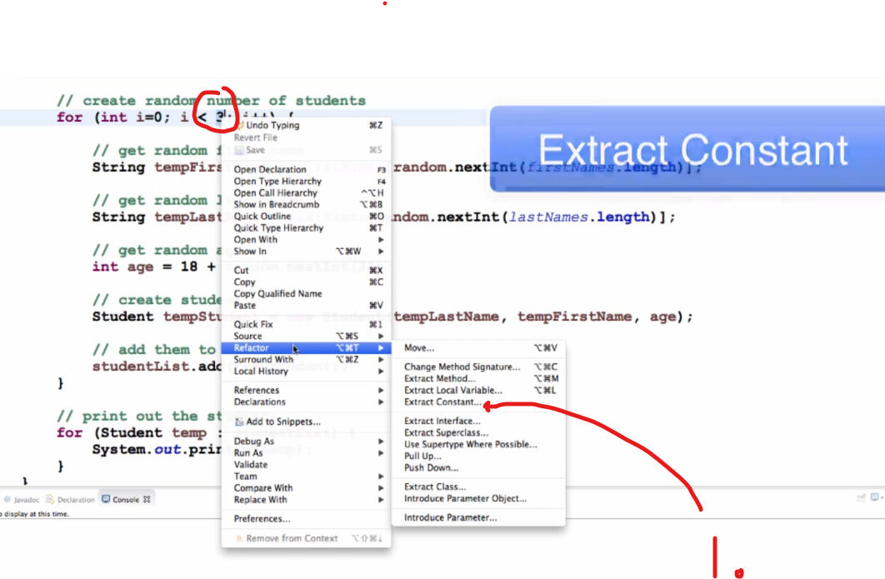

1. Write new for **Extracted Constant**

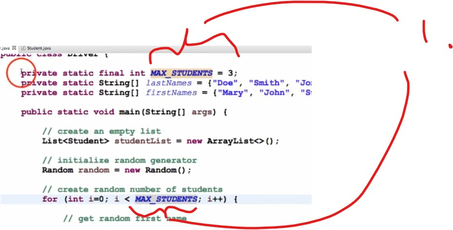

1. Extracted to own variable

### Extract Local Variables

> Color the code which you want to extract from code > Refactor > 

**Extract Local Variable**

### Extract Methods

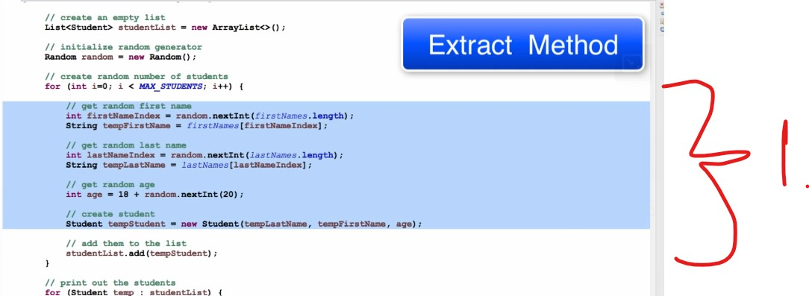

1. We can see this is one logical chunk of code, we want to extract this one

> Color the code which you want to extract to method > Refactor > **Extract Method...**

- Input name here to be refactored into 

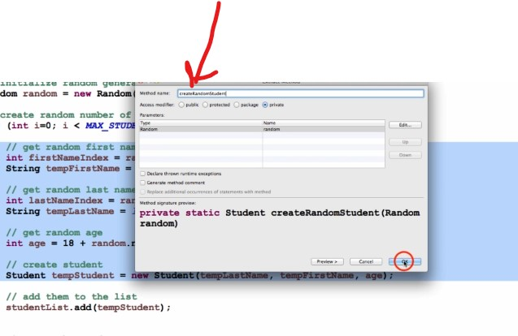

### Rename Method or variable

- Renaming method or variables

> Right-Click > Refactor > Rename...
