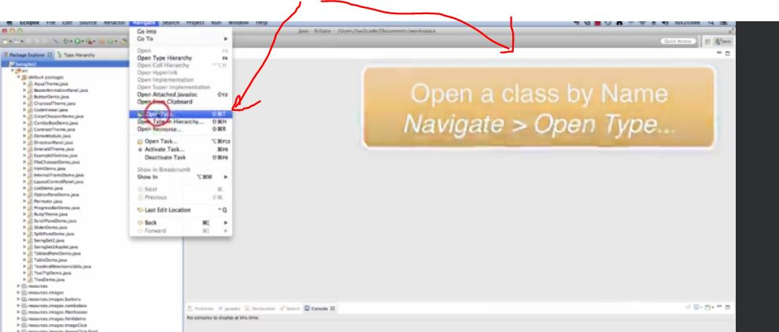
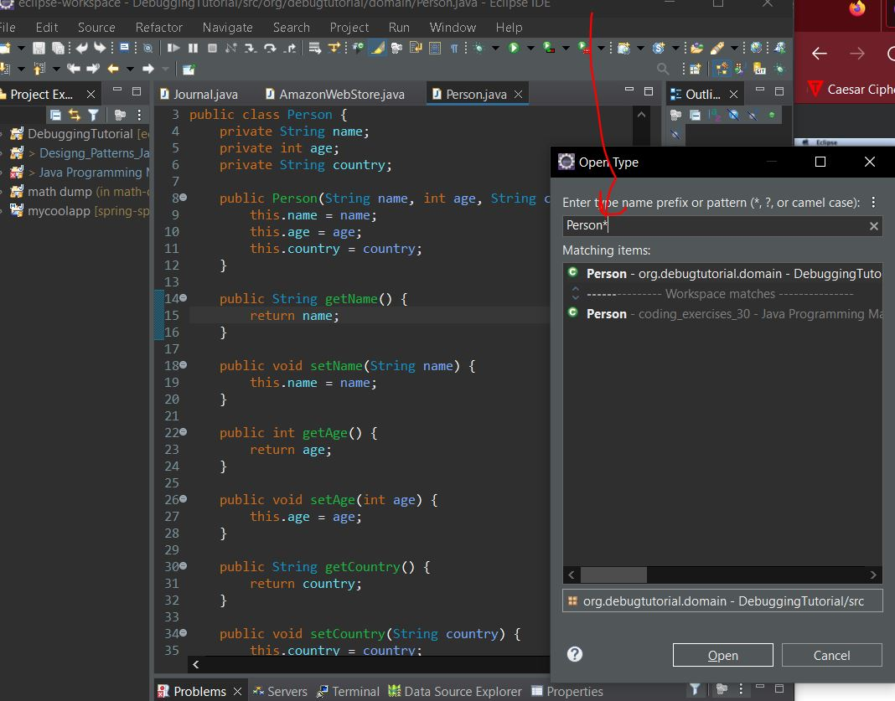
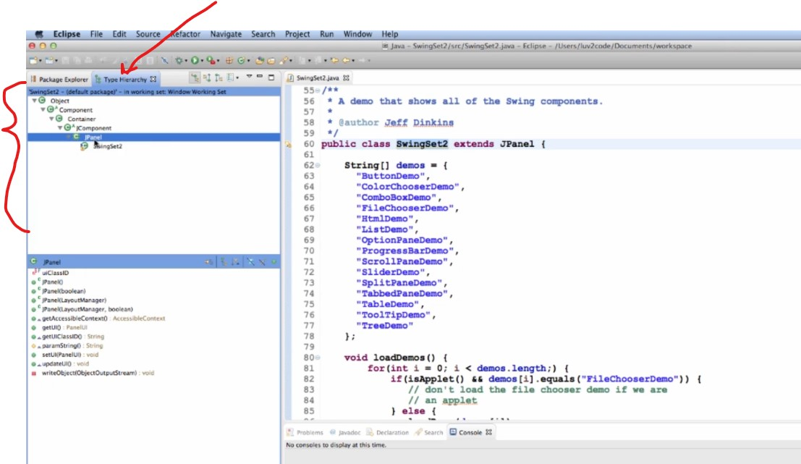
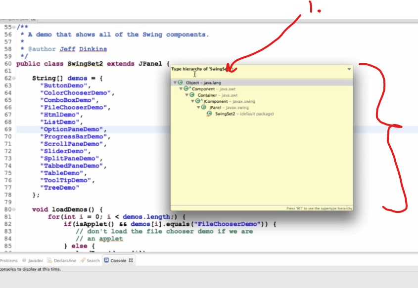
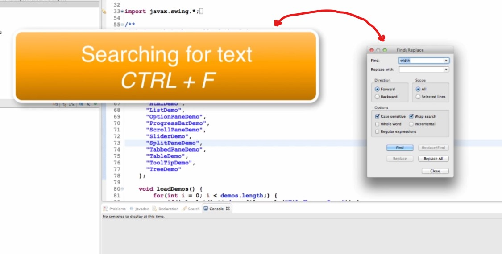
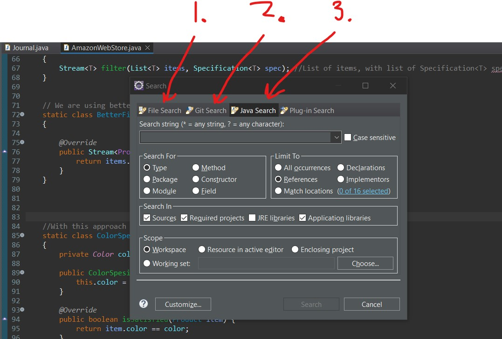
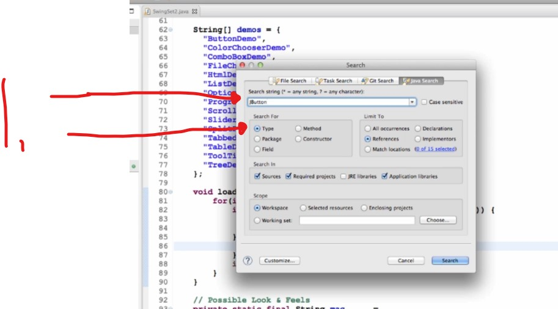
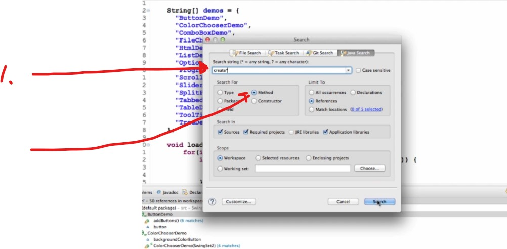

## Section 3: Managing Source Code

# What I Learned

### Open Type

- Open class by name

- We can open type by name from here

- You can use **wildcards** in Eclipse. Here is usage when opening type

### Quick Outline

- You can open outline view

- And it will look like such

- You can also filter in this menu

### Display inheritance tree

> **Navigate** > **Open Type Hierarchy** 

- This will help you to look inheritance tree for class

### Display quick inheritance tree

> Right-click > Quick Type Hierarchy

- Quick Type Hierarchy

1. You can type to filter 

### Search for text

> CTRL + F

- Search for text, with different tools

- If you have multiple files

### Search for multiple files

> Search > Search 

1. **File Search**, can search plain text from multiple files
2. **Git Search**, you can search against Git repository
3. **Java Search**, search against Java constructs

1. We are searching for where `JButton` is used in this project

1. We are using `*` wild card with method name `create*`. Searching **method** name start with `create`

4:00